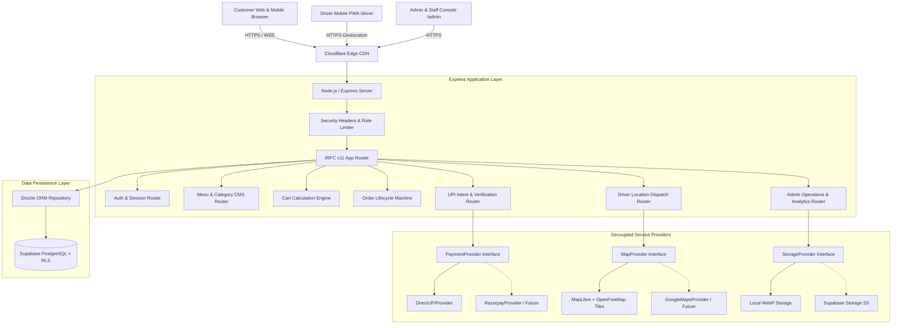

# Technical System Architecture — ARCHITECTURE.md

## Table of Contents
*   **1. Architectural Overview & Design Tenets** . . . . . . . . . . . . . . . . . . . . . . . . . . . . . . . . 1
*   **2. High-Level System Topology** . . . . . . . . . . . . . . . . . . . . . . . . . . . . . . . . . . . . . . . 2
*   **3. Decoupled Provider Abstraction Layers** . . . . . . . . . . . . . . . . . . . . . . . . . . . . . . . 3
    *   3.1 PaymentProvider Abstraction . . . . . . . . . . . . . . . . . . . . . . . . . . . . . . . . . 3
    *   3.2 MapProvider Abstraction . . . . . . . . . . . . . . . . . . . . . . . . . . . . . . . . . . . . 4
    *   3.3 StorageProvider Abstraction . . . . . . . . . . . . . . . . . . . . . . . . . . . . . . . . . . 5
    *   3.4 NotificationProvider Abstraction . . . . . . . . . . . . . . . . . . . . . . . . . . . . . . . 6
*   **4. Server-Authoritative Calculation Engine** . . . . . . . . . . . . . . . . . . . . . . . . . . . . . . 7
*   **5. Order Lifecycle & State Machine Transitions** . . . . . . . . . . . . . . . . . . . . . . . . . . . 8
*   **6. Delivery Driver Subsystem & Live GPS Telemetry** . . . . . . . . . . . . . . . . . . . . . . . 9
*   **7. Role-Based Access Control (RBAC) & Security Perimeter** . . . . . . . . . . . . . . . . . 10
*   **8. Real-Time Event Model & Synchronization** . . . . . . . . . . . . . . . . . . . . . . . . . . . . 11

---

## 1. Architectural Overview & Design Tenets

The technical architecture of the Shri Radhe Radhe Restaurant commerce platform is governed by five non-negotiable principles:

1.  **Zero Trust in Client-Side State**: All calculations (prices, taxes, delivery fees, packaging charges, coupon validation) are strictly executed on the server. The client submits only entity identifiers and desired quantities.
2.  **Sovereignty & Zero Vendor Lock-In**: The platform utilizes standard open-source protocols (PostgreSQL, tRPC, MapLibre, OpenStreetMap, Direct UPI) allowing independent operation without mandatory paid SaaS subscriptions.
3.  **Provider Extensibility via Clean Interfaces**: Subsystems that might evolve (such as payment gateways, map tile providers, or transactional SMS) are decoupled behind formal TypeScript interfaces.
4.  **Historical Immutability**: Orders write immutable relational snapshots of dish names, variant choices, add-on selections, and prices at the moment of order placement.
5.  **Strict Defense-in-Depth**: Multi-layered security encompassing database Row Level Security (RLS), tRPC procedure middleware, HTTP security headers, and rate limiting.

---

## 2. High-Level System Topology


*Figure 1 – Comprehensive System Topology and Service Decoupling*

---

## 3. Decoupled Provider Abstraction Layers

### 3.1 PaymentProvider Abstraction
The payment infrastructure is abstracted to enable direct peer-to-peer UPI at launch while permitting instant activation of payment gateways through the Admin Settings without code refactoring.

```typescript
export interface PaymentIntentResult {
  provider: "direct_upi" | "razorpay" | "cash_on_delivery" | "pay_at_pickup";
  intentUrl?: string;       // upi://pay?pa=... string
  qrPayload?: string;        // Text payload for dynamic QR code rendering
  gatewayOrderId?: string;  // Razorpay order ID if gateway enabled
  amount: number;           // Authoritative amount in INR
  currency: "INR";
  orderReference: string;
}

export interface PaymentVerificationResult {
  success: boolean;
  status: "PAYMENT_VERIFIED" | "PAYMENT_REJECTED" | "PAYMENT_PENDING_VERIFICATION";
  transactionId?: string;
  verifiedAt?: Date;
  verifiedBy?: number;
  reason?: string;
}

export interface PaymentProvider {
  name: string;
  generatePaymentIntent(order: OrderSnapshot): Promise<PaymentIntentResult>;
  verifyPaymentClaim(orderId: number, claim: PaymentClaimPayload): Promise<PaymentVerificationResult>;
}
```

### 3.2 MapProvider Abstraction
To avoid commercial Google Maps API bills while retaining crisp vector rendering, the platform abstracts map tile delivery and geocoding:

```typescript
export interface MapProvider {
  name: string;
  getTileUrl(): string;
  getAttribution(): string;
  calculateDistance(origin: [number, number], destination: [number, number]): {
    straightLineKm: number;
    estimatedMinutes: number;
  };
}
```
*Default Implementation*: Uses MapLibre GL JS with OpenFreeMap vector style JSON, rendering OpenStreetMap data with zero API key requirement.

### 3.3 StorageProvider Abstraction
Image storage is abstracted to handle local asset persistence with WebP transformation and Supabase Storage S3 bucket uploads seamlessly:

```typescript
export interface StorageProvider {
  uploadImage(fileBuffer: Buffer, mimeType: string, filename: string): Promise<{
    url: string;
    width: number;
    height: number;
    format: "webp";
  }>;
  deleteImage(url: string): Promise<boolean>;
}
```

---

## 4. Server-Authoritative Calculation Engine

The server recalculation pipeline protects against client manipulation:

```
[Incoming Order Request]
       │ (Item IDs, Variant IDs, Add-on IDs, Coupon Code, Fulfillment Type)
       ▼
1. Fetch authoritative active Menu Items, Variants, and Add-ons from DB
       │
2. Calculate raw Base Subtotal = Σ(Base Price + Variant Delta + Σ Add-on Prices)
       │
3. Evaluate Coupon Eligibility:
   - Check enabled status, start/end date, min cart value, usage limits
   - Calculate exact Discount amount
       │
4. Compute Restaurant Packaging Fee (configured in Restaurant Settings)
       │
5. Compute Delivery Fee (based on delivery zones / free delivery threshold)
       │
6. Compute GST Tax = (Subtotal - Discount) * Tax Rate
       │
7. Compute Final Authoritative Total = Subtotal - Discount + Packaging + Delivery + Tax
       │
8. Snapshot all calculations into immutable `orders` and `order_items` records
```

---

## 5. Order Lifecycle & State Machine Transitions

*Table 1 – Order State Machine Specification*

| State Name | Allowed Next States | Trigger Event | Authorized Actor |
|---|---|---|---|
| `PENDING_PAYMENT` | `PAYMENT_CLAIMED`, `PAYMENT_FAILED`, `CANCELLED` | Order created via checkout | Customer / System |
| `PAYMENT_CLAIMED` | `PAYMENT_VERIFIED`, `PAYMENT_REJECTED` | Customer enters UPI UTR / reference | Customer |
| `PAYMENT_VERIFIED` | `ACCEPTED`, `CANCELLED` | Staff confirms bank credit | Staff / Admin |
| `ACCEPTED` | `PREPARING`, `CANCELLED` | Kitchen acknowledges order | Staff / Admin |
| `PREPARING` | `READY`, `CANCELLED` | Chef begins cooking | Staff / Admin |
| `READY` | `OUT_FOR_DELIVERY`, `DELIVERED`, `CANCELLED`| Order packaged | Staff / Admin |
| `OUT_FOR_DELIVERY`| `DELIVERED`, `CANCELLED` | Driver dispatched with order | Driver / Staff |
| `DELIVERED` | None (Terminal) | Order handed to customer | Driver / Staff |
| `CANCELLED` | `REFUND_PENDING`, None (Terminal) | Cancellation with recorded reason| Staff / Admin |

Every state transition automatically writes a record to `order_status_history` storing `order_id`, `previous_status`, `new_status`, `changed_by_user_id`, `timestamp`, and `notes`.

---

## 6. Delivery Driver Subsystem & Live GPS Telemetry

*   **Driver Authentication**: Drivers authenticate via dedicated credentials and access the lightweight `/driver` mobile PWA.
*   **Coordinate Transmission**:
    *   When the driver taps "Start Delivery", the browser's `navigator.geolocation.watchPosition` streams coordinates every 10–15 seconds to the server.
    *   The server verifies that the caller is the assigned driver for that active order before persisting coordinates to `driver_locations`.
*   **Customer Map Privacy**:
    *   The `/track/:id` endpoint only emits driver coordinates while the order status is strictly `OUT_FOR_DELIVERY`.
    *   Once the order transitions to `DELIVERED`, location streaming is terminated immediately.
    *   Customers cannot access historical driver coordinates or coordinates of drivers delivering other orders.

---

## 7. Role-Based Access Control (RBAC) & Security Perimeter

*Table 2 – Access Control Permission Matrix*

| Resource / Action | Public / Guest | Customer | Order Staff | Menu Manager | Manager | Owner | Driver |
|---|---|---|---|---|---|---|---|
| **Browse Menu & Dishes** | READ | READ | READ | READ | READ | READ | READ |
| **Place Order & Claim UPI**| CREATE | CREATE | DENIED | DENIED | DENIED | DENIED | DENIED |
| **View Own Orders** | READ (Token)| READ | DENIED | DENIED | DENIED | DENIED | DENIED |
| **Verify UPI Payments** | DENIED | DENIED | READ/WRITE | DENIED | READ/WRITE | READ/WRITE | DENIED |
| **Live Order Queue Operations**| DENIED| DENIED | READ/WRITE | DENIED | READ/WRITE | READ/WRITE | DENIED |
| **Manage Menu & Categories** | DENIED| DENIED | DENIED | READ/WRITE | READ/WRITE | READ/WRITE | DENIED |
| **Manage Settings & Pause** | DENIED | DENIED | DENIED | DENIED | READ/WRITE | READ/WRITE | DENIED |
| **Manage Staff & Roles** | DENIED | DENIED | DENIED | DENIED | DENIED | READ/WRITE | DENIED |
| **View Audit Logs** | DENIED | DENIED | DENIED | DENIED | READ | READ/WRITE | DENIED |
| **Stream Delivery GPS** | DENIED | DENIED | DENIED | DENIED | DENIED | DENIED | WRITE (Assigned) |
