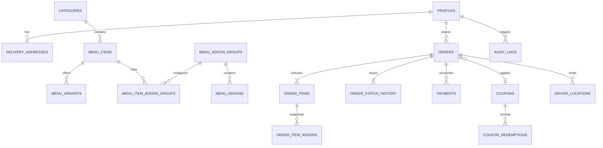

# Database Architecture & RLS Specification — DATABASE.md

## Table of Contents
*   **1. Relational Database Overview** . . . . . . . . . . . . . . . . . . . . . . . . . . . . . . . . . . . 1
*   **2. Entity Relationship Diagram (ERD)** . . . . . . . . . . . . . . . . . . . . . . . . . . . . . . . . 2
*   **3. Table Specifications & Schema Dictionary** . . . . . . . . . . . . . . . . . . . . . . . . . . . . 3
    *   3.1 Authentication & Profiles . . . . . . . . . . . . . . . . . . . . . . . . . . . . . . . . . . . . 3
    *   3.2 Customer Addresses . . . . . . . . . . . . . . . . . . . . . . . . . . . . . . . . . . . . . . . 4
    *   3.3 Categories & Menu Catalog . . . . . . . . . . . . . . . . . . . . . . . . . . . . . . . . . . . 5
    *   3.4 Menu Variants & Add-on Groups . . . . . . . . . . . . . . . . . . . . . . . . . . . . . . . 6
    *   3.5 Orders & Immutable Line Snapshots . . . . . . . . . . . . . . . . . . . . . . . . . . . . 7
    *   3.6 Order Status Audit History . . . . . . . . . . . . . . . . . . . . . . . . . . . . . . . . . . . 8
    *   3.7 Payments & Verification Queue . . . . . . . . . . . . . . . . . . . . . . . . . . . . . . . . 9
    *   3.8 Coupons & Redemptions . . . . . . . . . . . . . . . . . . . . . . . . . . . . . . . . . . . . 10
    *   3.9 Restaurant Settings & Business Hours . . . . . . . . . . . . . . . . . . . . . . . . . . . 11
    *   3.10 Driver Location Telemetry . . . . . . . . . . . . . . . . . . . . . . . . . . . . . . . . . . 12
    *   3.11 Administrative Audit Logs . . . . . . . . . . . . . . . . . . . . . . . . . . . . . . . . . . 13
    *   3.12 Table Reservations . . . . . . . . . . . . . . . . . . . . . . . . . . . . . . . . . . . . . . . 14
*   **4. Indexing Strategy & Query Performance** . . . . . . . . . . . . . . . . . . . . . . . . . . . . 15
*   **5. Row Level Security (RLS) Policies** . . . . . . . . . . . . . . . . . . . . . . . . . . . . . . . . . 16
*   **6. Data Migration & Seeding Strategy** . . . . . . . . . . . . . . . . . . . . . . . . . . . . . . . . 17

---

## 1. Relational Database Overview

The persistence architecture is built on standard PostgreSQL, fully compatible with the Supabase free tier. The database enforces strict referential integrity through foreign keys with explicit cascading or restrict rules, check constraints for positive quantities and valid price formats, and Row Level Security (RLS) ensuring that tenant data isolation is enforced at the database engine level.

---

## 2. Entity Relationship Diagram (ERD)

*Figure 1 – Comprehensive Database Relational Diagram*

---

## 3. Table Specifications & Schema Dictionary

### 3.1 Authentication & Profiles (`profiles`)
Stores core identity and role data for customers, staff, managers, and drivers.
*   `id`: `SERIAL PRIMARY KEY`
*   `auth_user_id`: `VARCHAR(64) UNIQUE NOT NULL` (maps to Supabase Auth UID or session OpenID)
*   `name`: `VARCHAR(160)`
*   `email`: `VARCHAR(320) UNIQUE`
*   `phone`: `VARCHAR(32)`
*   `role`: `VARCHAR(32) NOT NULL DEFAULT 'customer'` (Allowed: `owner`, `manager`, `order_staff`, `menu_manager`, `driver`, `customer`)
*   `created_at`: `TIMESTAMPTZ NOT NULL DEFAULT NOW()`
*   `updated_at`: `TIMESTAMPTZ NOT NULL DEFAULT NOW()`

### 3.2 Customer Addresses (`delivery_addresses`)
Stores customer delivery locations.
*   `id`: `SERIAL PRIMARY KEY`
*   `user_id`: `INT NOT NULL REFERENCES profiles(id) ON DELETE CASCADE`
*   `label`: `VARCHAR(60) NOT NULL` (e.g. 'Home', 'Work', 'Other')
*   `address_line`: `TEXT NOT NULL`
*   `city`: `VARCHAR(100) NOT NULL DEFAULT 'Darbhanga'`
*   `postal_code`: `VARCHAR(20) NOT NULL`
*   `landmark`: `VARCHAR(160)`
*   `latitude`: `DECIMAL(10, 7)`
*   `longitude`: `DECIMAL(10, 7)`
*   `created_at`: `TIMESTAMPTZ NOT NULL DEFAULT NOW()`

### 3.3 Categories (`categories`)
*   `id`: `SERIAL PRIMARY KEY`
*   `name`: `VARCHAR(100) NOT NULL`
*   `slug`: `VARCHAR(120) UNIQUE NOT NULL`
*   `description`: `TEXT`
*   `image_url`: `TEXT`
*   `display_order`: `INT NOT NULL DEFAULT 0`
*   `is_active`: `BOOLEAN NOT NULL DEFAULT TRUE`
*   `created_at`: `TIMESTAMPTZ NOT NULL DEFAULT NOW()`
*   `updated_at`: `TIMESTAMPTZ NOT NULL DEFAULT NOW()`

### 3.4 Menu Items (`menu_items`)
*   `id`: `SERIAL PRIMARY KEY`
*   `category_id`: `INT NOT NULL REFERENCES categories(id) ON DELETE RESTRICT`
*   `name`: `VARCHAR(180) NOT NULL`
*   `slug`: `VARCHAR(200) UNIQUE NOT NULL`
*   `description`: `TEXT NOT NULL`
*   `short_description`: `VARCHAR(255)`
*   `base_price`: `DECIMAL(10, 2) NOT NULL CHECK (base_price >= 0)`
*   `discount_price`: `DECIMAL(10, 2) CHECK (discount_price >= 0)`
*   `image_url`: `TEXT`
*   `dietary_type`: `VARCHAR(30) NOT NULL DEFAULT 'veg'` (`veg`, `non_veg`, `egg`, `vegan`, `jain`)
*   `spice_level`: `INT NOT NULL DEFAULT 0 CHECK (spice_level BETWEEN 0 AND 3)`
*   `prep_time_minutes`: `INT NOT NULL DEFAULT 25`
*   `is_featured`: `BOOLEAN NOT NULL DEFAULT FALSE`
*   `is_bestseller`: `BOOLEAN NOT NULL DEFAULT FALSE`
*   `is_available`: `BOOLEAN NOT NULL DEFAULT TRUE`
*   `display_order`: `INT NOT NULL DEFAULT 0`
*   `created_at`: `TIMESTAMPTZ NOT NULL DEFAULT NOW()`
*   `updated_at`: `TIMESTAMPTZ NOT NULL DEFAULT NOW()`

### 3.5 Menu Variants (`menu_variants`)
Sizes, portions, or crust selections.
*   `id`: `SERIAL PRIMARY KEY`
*   `menu_item_id`: `INT NOT NULL REFERENCES menu_items(id) ON DELETE CASCADE`
*   `name`: `VARCHAR(100) NOT NULL` (e.g. 'Regular', 'Large', 'Full Plate')
*   `price_delta`: `DECIMAL(10, 2) NOT NULL DEFAULT 0.00`
*   `is_default`: `BOOLEAN NOT NULL DEFAULT FALSE`
*   `is_available`: `BOOLEAN NOT NULL DEFAULT TRUE`
*   `display_order`: `INT NOT NULL DEFAULT 0`

### 3.6 Menu Add-on Groups & Add-ons (`menu_addon_groups`, `menu_addons`)
*   `menu_addon_groups`: `id`, `name`, `min_selection`, `max_selection`, `is_required`.
*   `menu_item_addon_groups`: `menu_item_id`, `addon_group_id`.
*   `menu_addons`: `id`, `addon_group_id`, `name`, `price` (`DECIMAL(10,2)`), `is_available`, `display_order`.

### 3.7 Orders & Snapshots (`orders`, `order_items`, `order_item_addons`)
*   `orders`:
    *   `id`: `SERIAL PRIMARY KEY`
    *   `order_number`: `VARCHAR(32) UNIQUE NOT NULL` (e.g. `RR-2026-0904-001`)
    *   `user_id`: `INT REFERENCES profiles(id) ON DELETE SET NULL`
    *   `customer_name`: `VARCHAR(160) NOT NULL`
    *   `customer_phone`: `VARCHAR(32) NOT NULL`
    *   `customer_email`: `VARCHAR(320)`
    *   `fulfillment_type`: `VARCHAR(30) NOT NULL` (`delivery`, `pickup`)
    *   `payment_method`: `VARCHAR(30) NOT NULL` (`direct_upi`, `cash_on_delivery`, `pay_at_pickup`, `razorpay`)
    *   `payment_status`: `VARCHAR(40) NOT NULL DEFAULT 'payment_initiated'`
    *   `order_status`: `VARCHAR(40) NOT NULL DEFAULT 'pending_payment'`
    *   `address_snapshot`: `TEXT`
    *   `address_notes`: `TEXT`
    *   `subtotal`: `DECIMAL(10, 2) NOT NULL`
    *   `discount_amount`: `DECIMAL(10, 2) NOT NULL DEFAULT 0.00`
    *   `packaging_fee`: `DECIMAL(10, 2) NOT NULL DEFAULT 0.00`
    *   `delivery_fee`: `DECIMAL(10, 2) NOT NULL DEFAULT 0.00`
    *   `tax_amount`: `DECIMAL(10, 2) NOT NULL DEFAULT 0.00`
    *   `total_amount`: `DECIMAL(10, 2) NOT NULL`
    *   `assigned_driver_id`: `INT REFERENCES profiles(id) ON DELETE SET NULL`
    *   `cancellation_reason`: `TEXT`
    *   `created_at`: `TIMESTAMPTZ NOT NULL DEFAULT NOW()`
    *   `updated_at`: `TIMESTAMPTZ NOT NULL DEFAULT NOW()`
*   `order_items`:
    *   `id`: `SERIAL PRIMARY KEY`
    *   `order_id`: `INT NOT NULL REFERENCES orders(id) ON DELETE CASCADE`
    *   `menu_item_id`: `INT REFERENCES menu_items(id) ON DELETE SET NULL`
    *   `item_name_snapshot`: `VARCHAR(180) NOT NULL`
    *   `variant_name_snapshot`: `VARCHAR(100)`
    *   `unit_price_snapshot`: `DECIMAL(10, 2) NOT NULL`
    *   `quantity`: `INT NOT NULL CHECK (quantity > 0)`
    *   `total_price_snapshot`: `DECIMAL(10, 2) NOT NULL`
    *   `special_instructions`: `VARCHAR(255)`
*   `order_item_addons`:
    *   `id`: `SERIAL PRIMARY KEY`
    *   `order_item_id`: `INT NOT NULL REFERENCES order_items(id) ON DELETE CASCADE`
    *   `addon_name_snapshot`: `VARCHAR(120) NOT NULL`
    *   `addon_price_snapshot`: `DECIMAL(10, 2) NOT NULL`

### 3.8 Order Status History (`order_status_history`)
*   `id`: `SERIAL PRIMARY KEY`
*   `order_id`: `INT NOT NULL REFERENCES orders(id) ON DELETE CASCADE`
*   `previous_status`: `VARCHAR(40)`
*   `new_status`: `VARCHAR(40) NOT NULL`
*   `changed_by_user_id`: `INT REFERENCES profiles(id) ON DELETE SET NULL`
*   `notes`: `TEXT`
*   `created_at`: `TIMESTAMPTZ NOT NULL DEFAULT NOW()`

### 3.9 Payments (`payments`)
*   `id`: `SERIAL PRIMARY KEY`
*   `order_id`: `INT NOT NULL REFERENCES orders(id) ON DELETE CASCADE`
*   `method`: `VARCHAR(30) NOT NULL`
*   `amount`: `DECIMAL(10, 2) NOT NULL`
*   `upi_reference`: `VARCHAR(64)` (UTR number)
*   `proof_image_url`: `TEXT`
*   `status`: `VARCHAR(40) NOT NULL DEFAULT 'payment_initiated'`
*   `verified_by_user_id`: `INT REFERENCES profiles(id) ON DELETE SET NULL`
*   `verified_at`: `TIMESTAMPTZ`
*   `rejection_reason`: `TEXT`
*   `created_at`: `TIMESTAMPTZ NOT NULL DEFAULT NOW()`

### 3.10 Coupons & Redemptions (`coupons`, `coupon_redemptions`)
*   `coupons`: `id`, `code` (UNIQUE), `description`, `discount_type` (`percentage`, `flat`, `free_delivery`), `discount_value`, `min_cart_value`, `max_discount`, `usage_limit`, `per_user_limit`, `starts_at`, `expires_at`, `is_active`.
*   `coupon_redemptions`: `id`, `coupon_id`, `order_id`, `user_id`, `discount_amount`, `redeemed_at`.

### 3.11 Restaurant Settings (`restaurant_settings`)
*   `id`: `INT PRIMARY KEY DEFAULT 1 CHECK (id = 1)` (Singleton Pattern)
*   `restaurant_name`: `VARCHAR(160) NOT NULL DEFAULT 'Shri Radhe Radhe Restaurant'`
*   `phone`: `VARCHAR(32) NOT NULL DEFAULT '+919876543210'`
*   `email`: `VARCHAR(320) NOT NULL DEFAULT 'contact@radheradhe.com'`
*   `address`: `TEXT NOT NULL DEFAULT 'Near Radhe Communication, Lohna Road, Dharampur, Manigachhi, Darbhanga, Bihar 847407'`
*   `latitude`: `DECIMAL(10, 7) NOT NULL DEFAULT 26.2182293`
*   `longitude`: `DECIMAL(10, 7) NOT NULL DEFAULT 86.2272110`
*   `upi_id`: `VARCHAR(100) NOT NULL DEFAULT 'radheradhe@upi'`
*   `upi_name`: `VARCHAR(160) NOT NULL DEFAULT 'Shri Radhe Radhe Restaurant'`
*   `ordering_paused`: `BOOLEAN NOT NULL DEFAULT FALSE`
*   `ordering_pause_message`: `TEXT DEFAULT 'We are temporarily paused for kitchen restock. Online orders will resume shortly.'`
*   `busy_mode`: `VARCHAR(20) NOT NULL DEFAULT 'normal'` (`normal`, `busy`, `very_busy`)
*   `prep_time_normal`: `INT NOT NULL DEFAULT 30`
*   `prep_time_busy`: `INT NOT NULL DEFAULT 50`
*   `prep_time_very_busy`: `INT NOT NULL DEFAULT 75`
*   `packaging_fee`: `DECIMAL(10, 2) NOT NULL DEFAULT 25.00`
*   `tax_percentage`: `DECIMAL(5, 2) NOT NULL DEFAULT 5.00` (5% GST)
*   `base_delivery_fee`: `DECIMAL(10, 2) NOT NULL DEFAULT 40.00`
*   `free_delivery_threshold`: `DECIMAL(10, 2) NOT NULL DEFAULT 499.00`
*   `updated_at`: `TIMESTAMPTZ NOT NULL DEFAULT NOW()`

### 3.12 Driver Telemetry (`driver_locations`)
*   `id`: `BIGSERIAL PRIMARY KEY`
*   `driver_id`: `INT NOT NULL REFERENCES profiles(id) ON DELETE CASCADE`
*   `order_id`: `INT NOT NULL REFERENCES orders(id) ON DELETE CASCADE`
*   `latitude`: `DECIMAL(10, 7) NOT NULL`
*   `longitude`: `DECIMAL(10, 7) NOT NULL`
*   `accuracy`: `DECIMAL(6, 2)`
*   `recorded_at`: `TIMESTAMPTZ NOT NULL DEFAULT NOW()`

### 3.13 Audit Logs (`audit_logs`)
*   `id`: `BIGSERIAL PRIMARY KEY`
*   `actor_id`: `INT REFERENCES profiles(id) ON DELETE SET NULL`
*   `actor_role`: `VARCHAR(32)`
*   `action`: `VARCHAR(80) NOT NULL` (e.g., 'price_updated', 'payment_verified', 'order_cancelled')
*   `resource`: `VARCHAR(60) NOT NULL` (e.g., 'menu_item', 'order', 'payment')
*   `resource_id`: `INT`
*   `diff_snapshot`: `JSONB`
*   `ip_address`: `VARCHAR(45)`
*   `user_agent`: `TEXT`
*   `created_at`: `TIMESTAMPTZ NOT NULL DEFAULT NOW()`

---

## 4. Indexing Strategy & Query Performance

*Table 1 – Core Performance Indexes*

| Table | Index Columns | Purpose |
|---|---|---|
| `menu_items` | `(category_id, is_available, display_order)` | Fast category menu browsing. |
| `menu_items` | `slug` | Fast SEO dish lookup. |
| `orders` | `(order_status, created_at DESC)` | Admin live queue sorting. |
| `orders` | `(user_id, created_at DESC)` | Customer order history pagination. |
| `orders` | `order_number` | Quick order search by reference. |
| `payments` | `(status, created_at DESC)` | Payment verification queue. |
| `driver_locations` | `(order_id, recorded_at DESC)` | Fetching latest driver GPS coordinate. |
| `coupons` | `code` | Instant promo code validation. |

---

## 5. Row Level Security (RLS) Policies

All public and private tables have Row Level Security enabled (`ALTER TABLE ... ENABLE ROW LEVEL SECURITY;`).

*Table 2 – RLS Policy Enforcement Matrix*

| Table | Policy Name | Permitted Roles | SQL Condition |
|---|---|---|---|
| `menu_items` | `Public menu read` | `anon, authenticated` | `FOR SELECT USING (is_available = TRUE)` |
| `menu_items` | `Staff menu modify` | `authenticated (staff/admin)` | `FOR ALL USING (auth.jwt()->>'role' IN ('owner', 'manager', 'menu_manager'))` |
| `orders` | `Customer read own orders` | `authenticated (customer)` | `FOR SELECT USING (user_id = auth.uid())` |
| `orders` | `Staff read all orders` | `authenticated (staff/admin)` | `FOR ALL USING (auth.jwt()->>'role' IN ('owner', 'manager', 'order_staff'))` |
| `orders` | `Driver read assigned` | `authenticated (driver)` | `FOR SELECT USING (assigned_driver_id = auth.uid())` |
| `driver_locations` | `Customer read active delivery`| `authenticated / anon (with token)`| `FOR SELECT USING (EXISTS (SELECT 1 FROM orders WHERE orders.id = driver_locations.order_id AND orders.order_status = 'out_for_delivery' AND orders.user_id = auth.uid()))` |
| `driver_locations` | `Driver insert own location`| `authenticated (driver)` | `FOR INSERT WITH CHECK (driver_id = auth.uid() AND EXISTS (SELECT 1 FROM orders WHERE orders.id = order_id AND orders.assigned_driver_id = auth.uid() AND orders.order_status = 'out_for_delivery'))` |
| `audit_logs` | `Owner only read audit` | `authenticated (owner/manager)` | `FOR SELECT USING (auth.jwt()->>'role' IN ('owner', 'manager'))` |
